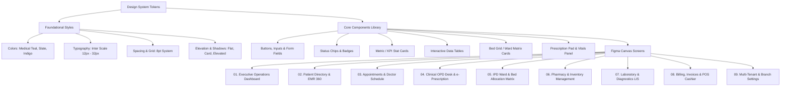

# HMS HealthCore — Figma Design System & Full UI Specification

Welcome to the complete design system and Figma UI architecture guide for the **Hospital Management System (HMS)**. This document specifies all design tokens, component libraries, Auto-Layout frame hierarchies, user flows, and 1-click Figma import workflows.

---

## 1. Design System Architecture

---

## 2. Color Palette & Semantic Tokens

| Token Name | Hex Code | Tailwind Equivalent | Semantic Purpose |
| :--- | :--- | :--- | :--- |
| `primary.600` | `#0D9488` | `teal-600` | Primary action buttons, active navigation indicator, brand identity |
| `primary.50` | `#F0FDFA` | `teal-50` | Primary active card background, subtle active highlights |
| `secondary.600` | `#4F46E5` | `indigo-600` | Secondary links, specialty badges, doctor roles |
| `neutral.900` | `#0F172A` | `slate-900` | Main text titles, dark sidebar background option, modal headers |
| `neutral.700` | `#334155` | `slate-700` | Body copy, table header labels, form field labels |
| `neutral.500` | `#64748B` | `slate-500` | Secondary metadata, timestamps, input placeholders |
| `neutral.100` | `#F1F5F9` | `slate-100` | Light canvas background, table alternating row tint |
| `success.500` | `#10B981` | `emerald-500` | Paid status, Bed Available, Normal vitals, Completed appointments |
| `warning.500` | `#F59E0B` | `amber-500` | Partially Paid, Bed Maintenance, Low Stock Alert, Lab In-Progress |
| `danger.500` | `#F43F5E` | `rose-500` | Unpaid Invoice, Critical Vitals Alert, Bed Occupied (Emergency) |
| `info.500` | `#0EA5E9` | `sky-500` | Bed Occupied (Standard), Scheduled Appointment, Info notices |

---

## 3. Typography Scale (Inter / Roboto)

The system uses an 8pt grid with minimum 12px (`caption`) to comply with healthcare accessibility standards.

| Level | Size / Line Height | Weight | Tracking | Usage |
| :--- | :--- | :--- | :--- | :--- |
| **Display 1** | `32px / 40px` | Bold (`700`) | `-0.02em` | Metric KPI big numbers, Executive stats |
| **Heading 1** | `24px / 32px` | SemiBold (`600`) | `-0.01em` | Screen titles, Patient 360 name headers |
| **Heading 2** | `20px / 28px` | SemiBold (`600`) | `0` | Section headings, Ward group titles, Card headers |
| **Heading 3** | `18px / 24px` | Medium (`500`) | `0` | Modal headers, Sub-panel titles |
| **Body Large** | `16px / 24px` | Regular (`400`) | `0` | Primary patient complaints, clinical notes |
| **Body** | `14px / 20px` | Regular (`400`) | `0` | Table data cells, Form input values, Nav items |
| **Caption / Label** | `12px / 16px` | Medium (`500`) | `+0.01em` | Status chips, field helper text, table column headers |

---

## 4. Figma Screen Blueprint & Frame Specifications

### Screen Canvas Dimensions
- **Desktop Primary**: `1440px × 900px` (Min-height: Auto-scroll)
- **Top Bar**: Fixed `Height: 64px`, Width `1440px`, Padding `16px 24px`, Border Bottom `1px #E2E8F0`
- **Sidebar**: Fixed `Width: 260px`, Height `calc(100vh - 64px)`, Auto-layout Vertical, Padding `16px 12px`
- **Main Viewport**: Auto-layout Vertical, Width `1180px`, Padding `24px 32px`, Gap `24px`

---

## 5. How to Import the Full UI into Figma (1-Click Guide)

You have two simple ways to bring this exact interactive prototype into Figma as 100% editable vector layers:

### Method A: Using the `html.to.design` Figma Plugin (Recommended)
1. Open Figma and open an existing or new design file.
2. Go to **Plugins** -> Search for **`html.to.design`** (or **Builder.io HTML to Figma**).
3. Open the interactive prototype file in your browser:
   `figma/hms_figma_prototype.html`
4. Copy the URL or click the **"Copy Figma HTML"** button inside the prototype's Figma Toolkit drawer.
5. In the Figma plugin, paste the URL or HTML code and click **"Import"**.
6. Figma will automatically convert every HTML element, Tailwind layout, button, and card into **native Figma Frames with Auto-Layout, editable typography, and vector SVG icons**!

### Method B: Using `Tokens Studio for Figma`
1. Install **Tokens Studio for Figma** plugin.
2. Click **Load Tokens** -> Select `figma/figma_tokens.json`.
3. All primary, secondary, status, typography, spacing, and radius variables will immediately appear in your Figma Local Variables and Styles panel!

---

*Generated for HMS HealthCore v1.0 Enterprise Architecture.*

